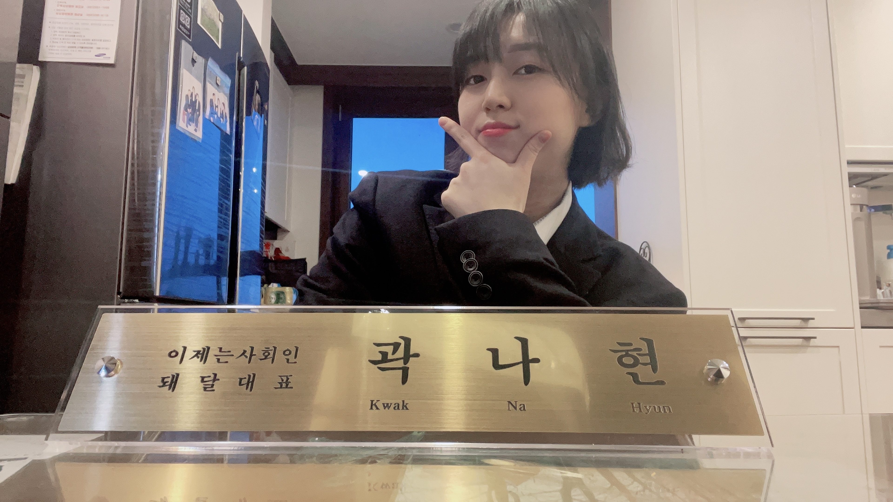
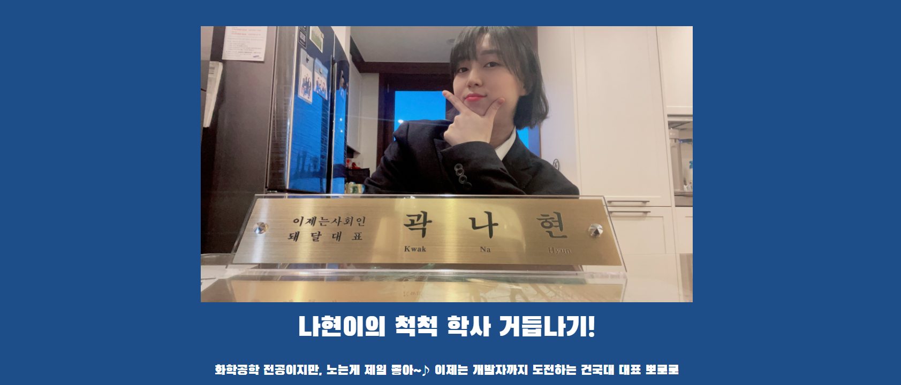

# 종백쌤과 함께하는 단기속성 내 홈페이지 만들기 프로젝트

> 설 연휴동안 SSAFY에서 배운걸 최대한 활용해서!!!!GIT HUB으로 내 포트폴리오겸 홈페이지 만들기!!!!!!! 


## 2월 8일: 들어가기 앞서 구상

나는 우선 전문적인 내 이력을 보여주는 포트폴리오 보다는 그냥, 내가 좋아하는 내 그림 끄적이고 나를 담을 수 있는 홈페이지를 만들기로 기획했다. 이름하여, 졸업을 맞이하여 척척 학사로 거듭나기..! (박사보다 무섭다는 자신만만 학사) 나는 내가 말이 많다는 걸 알고는 있었지만, 이 성격이 치명적인 단점이 될줄은 몰랐다. 하고 싶은 말은 너무 많고 구현하기는 아직 실력이 미흡해 ^~^ 아주 욕망덩어리.. 나는 욕심boy...

2/8일 월요일에 다같이 디스코드에 모여서 같이 프로젝트를 진행하는 팀원들끼리 서로의 구성안을 공유했다. 다들 발표를 들으면 들을 수록 뭔가 자기 자신들에 대해 잘 알고 확신이 있는 사람들이 많다는것이 느껴진다. 정말 부러운 부분!~! 그리고 정말 전문적이시다.. 나는 뭔가 아직 장난같은 퀄리티의 결과물들 밖에 없는데^^~ 사실 얼마전까지만 해도 이런 미흡함?에 대해서 스스로 스트레스를 많이 받았는데 이제는 걍 별로 안받는다. 24살의 나현이는 이제 안다.. 스트레스 받아봤자 나는 그런 스타일의 결과물은 못낸다는거.. 아기자기하고 정신사납고 뽀짝한 것이,, 그거시,,,바로 나의 결과물이 될 수 밖에 없는 운명..

것봐 지금도 자야되면서 서론 오지게 길게 쓰고있따 쥼맬 나는 말썽쟁이

[초기 기획안]: https://github.com/moongchi98/my_portfolio/blob/main/%EB%82%98%ED%98%84_%ED%99%88%ED%8E%98%EC%9D%B4%EC%A7%80_%EA%B8%B0%ED%9A%8D%EC%84%9C.pdf


## 2월 9일: Navbar, Section 제작

쥼맬..다들..너무 열심히 한다..나는 술이나 와랄라 먹고..들어왔는데 다들 엄청 열심히 하고 계셔서 술 좀 깨고 12시부터...헐레벌떡 조금 끄적였다.. 만든거라 하기도 뭐하고 배웠던 Navbar하면서,,뭐 내용좀 끄적였다..

> 사용한 것들!
>
> 1. Bootstrap Navbar
> 2. 외부참조로 css 파일 이용하기
> 3. google font 직접 사용해보기

- **Navbar**

  ```html
  <header class="sticky-top">
      <!-- navbar -->
      <nav class="navbar bg-white">
        <div class="container-fluid">
          <a class="navbar-brand" href="#">
            
          </a>
          <ul class="nav justify-content-center">
            <li class="nav-item">
              <a class="nav-link active sans classicblue fs-3" aria-current="page" href="#">나현?나현!</a>
            </li>
            <li class="nav-item">
              <a class="nav-link sans classicblue fs-3" href="#">화학공학</a>
            </li>
            <li class="nav-item">
              <a class="nav-link sans classicblue fs-3" href="#">Interest</a>
            </li>
            <li class="nav-item">
              <a class="nav-link sans classicblue fs-3" href="#">SW 개발</a>
            </li>  
          </ul>
        </div>
      </nav>
    </header>
  ```

  배웠던 거에서 크게 차이는 없다. 다만 좀 애를 먹었던거는 역시 로고 사진 사이즈 조절. 이거는 내 감대로 그냥 정방향 모양으로 사이즈를 줬다. 그리고 `sticky-top`은 가장 큰 box인 header에 class를 지정해줘야 작동한다는 정도?

  Interest탭을 뭔가 더 멋진 이름으로 하고 싶은데 아직 아이디어가 안떠오른다.

  

  :heavy_check_mark: 해야할일

  각각 tab에 link 달기

  

- **Section**

  1. preview 내용 작성한 부분

     ```html
     <div class="row d-flex flex-column align-items-center">
             
             <h1 class="sans text-white text-center mt-3">나현이의 척척 학사 거듭나기!</h1>
             <p  class="sans text-white text-center mt-3 fs-5">화학공학 전공이지만, 노는게 제일 좋아~♪ 이제는 개발자까지 도전하는 건국대 대표 뽀로로 </p>
             <p  class="sans text-white text-center mt-3 fs-5">의미있는 경험 하나하나가 잊혀지는게 너무 아까워서, 또 나의 20대를 나답게 기록하고 싶어서 시작한 이 페이지! </p>
             <p  class="sans text-white text-center mt-3 fs-5"> 이 곳이 미래의 나현이에게는 언제나 열정을, 추억을 주는 곳이자 계속 나의 이야기를 채워나가는 곳이 되면 좋겠습니다. </p>
             <p  class="sans text-white text-center mt-3 fs-5"> 그리고, 이 누추한 곳 까지 와계신 여러분에게도 그러한 곳이면 좋겠습니다. </p>
           </div>
     ```

     :question: 궁금한 점 

     저렇게 p태그를 계속 쓰는게 아니라, 한번에 문장을 구분해서 작성하는 방법은 없는걸까?

     

  2. 내 머릿속 부분

     여기서 부터 깨닫게 되었다,, 이 프로젝트의 가장 큰 문제는 개발 실력이 아니라 내 그림 실력이라는 것을,,

     술 마시는 옆모습을 못그려서 20분동안 쩔쩔...
  
     ```html
     <div class="row coconut flex-column align-items-center">
             <h2 class="pirate text-center sans mt-3">2021년 2월 24.2살의 나는?</h2>
             <p  class="pirate text-center sans mt-2 fs-5">천방지축 얼렁뚱땅 빙글빙글 돌아가는 지금의 나는 무슨 생각 중일까..?</p>
             <div class="d-flex justify-content-center">
               <a href="https://sports.news.naver.com/wfootball/record/index.nhn">
                 
               </a>
               <a href="#">
                    
               </a>
               <a href="#">
                 
               </a>
             </div>
         </div>
     ```

     음 사실 이 부분에서는 내 최대 관심분야? 지금의 나를 나타내는 키워드? 같은 걸 하고 싶은데 뭔가 마음에 안든다.. 나중에 가면 전면 수정 될 거 같다.. 아래에 글씨로 해당하는 내용을 적고 싶었는데 안이쁜것 같고 손글씨가 더 이쁜것 같기도 하다가, 나중에는 그림만 있는게 제일 이쁜거 같아서 일단은 그림만 두었다. 요즘 리버풀 축구 짱못하니까 순위좀 걸어두고 삼성로고에는 내 목표인 대주주,, 삼성 주가를 걸어놓을까 생각중이다. 술은 요즘 좋아하는 술? 아니면 술마시고 사고친 리스트 목록을 만들어서 링크로 걸어놓을까 고민중! 고민은 내일,,하고,,자야지.,
  
     
     
     :heavy_check_mark: 그림, 글 다 맘에 안들어 전면 수정해야해,,


## 2월 12일: 화학공학 페이지 제작 시작

3일간 열심히 놀았땅,,,우히히,, 그런데 하면 할 수록 자신감이 떨어진다 세상에서 내 페이지가 가장 안예쁜 느낌,, 당연한거지만 피피티 처럼 아니면 포토샵 처럼 내가 손으로 하나하나 움직일 수 없다는 게 너무 답답하다. 그리고 그린 이미지들을 다시 배경 제거해서 홈페이지에 기재해야하는 것에서 엄청난 귀찮음을 느끼고 있다. 그리고 폰트가!!!!!!!!! 너무 가독성이 떨어진다!!!!! 가독성이 좋은 noto-sans는 또 제목으로 두껍게 들어갔을 때 너무 안예쁘다. 세상에서 디자인 작업할때 제일 싫어하는게 폰트 여러가지 사용하는 건데,, 지금 내 홈페이지가 딱 그상황이네? 데헷~!

- **공정 모사 프로그램 **

  

  저렇게 배치하기 위해서 진짜 넴모넴모를..오지게 그렸다. 또, 내가 그린 그림들은 아무래도 사이즈가 균일하지 않다보니까 배치하는데 큰 어려움을 겪었다. 그래서 넴모안에->넴모-> 넴모..이런식의 무한 넴모에 갇혔다.

  석탄 아이콘에는 우리가 작성했던 보고서 링크를 걸고 싶었는데, 같이 작성한 친구들한테 혼날 것 같아서 아직은 안걸었다. 유튜브 아이콘에는 내 유튜브 채널로 바로 이어지도록 했다. 오랜만에 내 퀘퀘묵은 채널을 들어가 봤는데 모르시는 분이 엄청 열성적으로 댓글을 달아주셨따,,? 뭐지,,? 

  이거 하나 만드는데 너무 너무 힘들어서 경력은 두개만 넣어야겠다고 갑자기 노선변경함^^~!

- **공정 제어 **

  

  뭔가 보기 멋지게,, 좌우 배치하고 싶었는데 2번에 충격적으로 쓸 내용이 없었다 ㅋㅋㅋㅋ 사실 1번의 프로그램이랑 거의 동일한 내용인데 3개는 써보고 싶어서 나눈건데.. 내가 했던 프로젝트들은 진짜 기초 중에 왕 기초 ㅋ라서,, 저기 링크걸어서 하기도 너무 창피하기 때문에 나는 여백의 미를 강조하겠서 *'ㅂ'*~~ 매트랩 로고가 멋져서 다행이다 ㅋㅅㅋ.. 여기서 사실 현타왔다 왕 나 4년 내내 학생회 했떤거 빼고는 한게 없네,,,? 역시 술만 먹었던거였어~~ 근데 후회는 안한다 돌아가도 똑같이 살게 분명함 

  

- **반도체, 측정 장비 **

  

  진짜 이것도 어거지 경력 222.. 멱살잡고 같이 이 교육을 알려준 세현이에게 다시 무한 감사를.. 내 목표는 반도체 측정 분야에 취업하는 거지만 사실 우리학교 우리과는 정통 화공(석유집)에 초점이 맞춰있어서, 반도체 교육이 굉장히 없당. 그래서 내가 추가로 수강했던 장비 교육 명단을 추가하였다.(영어라 개 멋있음) 그리고 이제 이미지 크롭해서 사이즈 조절하는게 조금은 시간이 빨라졌다. 저 그림을 누르면 내 실습당시 팹에서 있던 사진이 나온다!~ 나름의 선 물 ^^


## Interest 제작

뭔가 색다른 기능을 써서 제작해보고 싶단 마음에,, 배경 색을 coconut으로 했찌만 완존 구리다! ^^~! 그래도 색조합 고민한 시간이 너무 아까워서 제목정도에만 사용했다. 대내외활동을 위한 페이지 였는데 나 진짜 대내활동만 엄청 해서 쓸게 별로 없었다.. 결국 난 곽나현 대학 생활- 학생회 = 0 의 공식은 성립했다.. 나는 에타인들이 혐오하는 학생회 이얏호^~^! 교환학생, 뭐 동아리 등등 엄청 넣고싶었는데 너무너무 지쳐서 그림그리기도 너무너무 지쳐서 (사실 알고리즘 공부가 더 시급하단걸 깨닫고 오늘 안에 끝내겠다는 의지) 후ㅣ뚜루 마뚜루~ 대충 사진아무거나 넣고 끝내버렸다 데헷!~

- **학생회 활동**

  - 동영상 첨부

  내 학생회장 임기를 돌아볼때 가장 눈물 버튼인 대화제때 사용했던 동영상을 처음에 넣었다. 언제나 볼 수 있게! (얘들아 초상권 미안~) 나는 Bootstrap(이건 여담인데 나 맨날 스펠링 틀린다 boostrap인줄,,부스트랩,,너의 디자인에 부스터를 달아준다 이런의미의 사이트 이름인줄 알았다)에서 동영상을 추가하는 방법은 *embed*라는 걸 사용해서 추가한다. 그런데, 나는 아무리 아무리! 해도 동영상이 화면의 full size가 안되는 것이다! 구글링을 했는데, 아 이건 내가 해결이 어렵다 생각해서 종백쌤(이제는 쌤이라 불러야 할 것 같다)한테 긴급 도움을 요청했는데, embed는 보통 유튜브 같은 링크를 통해서 동영상을 추가할 때 사용하는 방법이라고 한다! 나 처럼 동영상 파일을 추가하는 과정은 보통 `videotag`라는 것을 더 많이 사용한다고 한다. 보내주신 `videotag`관련 문서를 읽어보니까, 이걸 사용할때는 꼭! width, height를 설정해줘야 한다고 한다. 나는 꽉 차는 화면을 원해서 둘다 100%로 설정하였다. (나는 아니고 종백님이 해주시긴했찌만 ^^~)

  ```html
  <div class="bluebox">
        <h2 class="dohyun text-white mx-5 py-3"> 학과 학생회</h2>
        <!-- 후엥 이거 왜 풀스크린으로 안돼,,? -->
        <div class="embed-responsive embed-responsive-16by9">
          <video height="100%" width="100%" controls>
            <source src="images/학생회.mp4" type='video/mp4'>
          </video>
        </div>
      </div>
  ```

  - 활동 내역 작성

    여기서는 `col`을 활용해서 최대한 모바일에서도 깨지지 않고, 사실 3개를 가장 쉽게 영역 분배를 하고 싶어서 col을 사용했다.

    확실히 `gird`랑 `flex`를 같이 사용하면, 정말 편한거 같다! grid로 우선 큰 넴모들을 가로로 레이아웃 해주고, 개별 넴모들에서 세로로 작성하고 싶은 내용들을 ` flex-column`으로 설정해주면 나름 뚝! 딱! 이다. 그리고, 진짜 한게 학생회장 밖에 없으니까 여기서 멋지게 보이고 싶어서 모든 행사를 풀어썼다 ㅋㅋㅋㅋㅋ 아 총무애들이랑 학생회 애들이 보면 비웃겠지만 괜찮아 나만 보면되니까. 내가 했던 결과물들(디자인 결과물들)을 링크를 추가해서 뭔가 멋지게 carosel로 하고 싶었는데, 체력이 딸려서 gg하고 구냥 작게 아래에 링크 걸어서 추가해놓았다. 보여줄것도 없지만 ㅋㅅㅋ,, 4학년 2학기쯤에 대회 준비하면서 프로그램때문에 노트북을 아예 리셋했는데, 그때 학생회했던 자료가 많이 날라가서 별로 첨부할 게 없어서 아쉬웠다.( 사실 많은데 개구려서 안함 :frog:) 

    

  - 교환학생

    힘들다 이제,, 이 프로젝트를 하면서 느낀건데 말 많은게 최대장점이 진짜 아무것도 아닌거를 약력처럼 쓸 수 있음. 역시 나는 내용이 공허한 자소서 작성 장인,,

    


## SW 개발 제작

요기는 내 SSAFY내용을 적을 공간이다! 아직은 암것도 없으니까 ! 내 SSAFical 활동 인스타 프사랑, 아이디 추가해놓았다. 내 카드뉴스 개구려서 아무도 안봤으면 좋겠긴함. 만약!! 2월 월말 평가를 통과한다면(해야하지만) IM딴거를 여기다 첫 게시물로 하겠다! 


## Index(첫 페이지) 결국 수정

내 머릿속 부분,, 결국 구리고 구려서 볼때마다 나의 분노를 일으켰던 곳은 그냥 깔끔하게 contact 정보칸으로 변경했다. 여기서 awesomefont 아이콘들을 처음 써봤다. icon 사이즈 조정을 `font-size`로 준다는 것을 처음 알았다. 그리고, 여기서 icon에다가 링크를 거니까 파란색으로 변해서, 이걸 없애기 위해서 `deco-none`도 하고 별거별거 다 해봤다. 내가 결국 사용한 방법은 link를 걸어주는  `a`   	태그에다가, `color class` 지정하는 방법을 사용했다. 

:rocket: font-awesome 사용 방법

```html
<!--head에 이거 걸어주셈-->
<link rel="stylesheet" href="https://use.fontawesome.com/releases/v5.15.2/css/all.css" integrity="sha384-vSIIfh2YWi9wW0r9iZe7RJPrKwp6bG+s9QZMoITbCckVJqGCCRhc+ccxNcdpHuYu" crossorigin="anonymous">

<!--body-->
<span style="font-size: 5em;" class="pirate col-3 text-center">
          <a href="https://moongchi-is-here.tistory.com/" class="pirate">
            <i class="fas fa-blog"></i>
          </a>
          <p class="text-pirate text-center dohyun fs-3">moongchi-is-here</p>
        </span>

```

`span`으로 큰 넴모를 지정해줘야, 영역을 inline으로 차지해서 레이아웃 조정해주기가 쉽다. 


## 프로젝트를 마치며!

나는 사실 다른분들 만큼 열심히 하지두 않았고, 진짜 잘 놀고 하루 날잡고 완성한 케이스라 분명히 허접하다. 그런데, 예전부터 노마드 코더나 다른 코딩 유튜브를 보면 항상 하시는 말씀이 일단 언어를 마스터 할 생각을 하지말고 뭔가를 시작해봐라! 였는데, 이걸 하면서 그 말에 엄청 공감이갔다. 코딩도 결국 정말 언어다! 내가 영어를 확 상승시킬 수 있던것도, 어릴때 갔던 유학이였는데 그것처럼 이 프로젝트가 나한테는 유학이였다고 생각된다 ㅋㅅㅋ! 절대 잘하는 거는 없지만, 부족한 실력으로라도 구글과 함께 (+종백쌤과 1반 동기들)한다면 뚱땅뚱땅 뭐라도 하게 되는 것 같다.. 디자인을 좋아하는 나로써는 힘들면서도(손처럼 바로바로 수정이 못한다는 분노 :fire:) 어쨌든 내가 원하는 대로 만들 수 있어서 너무 재밌었다!.! 이제 두렵지 않다! 이 페이지를 까먹지 않고 틈틈히 업데이트 해줘서, 10년 20년후에도 내 흑역사 처럼 언제나 들려서 이때의 열정과 기분을 느낄 수 있는 공간이 됬으면 좋겠다! 이런 프로젝트를 기획하고 감시해주신 1반의 빅 브라더 종백쌤에게 제일 감사를 드리며, 거북목을 얻은 나현아 수고했다~~~~~~~ ssafy 인터뷰+기말+E1 면접이 겹쳐서 유노윤호가 되겠다고 다짐했던 짤을 재탕하면서,, 나의 홈페이지 소개서(를 가장한 일기장)을 마친다!~!~!~! :star:


